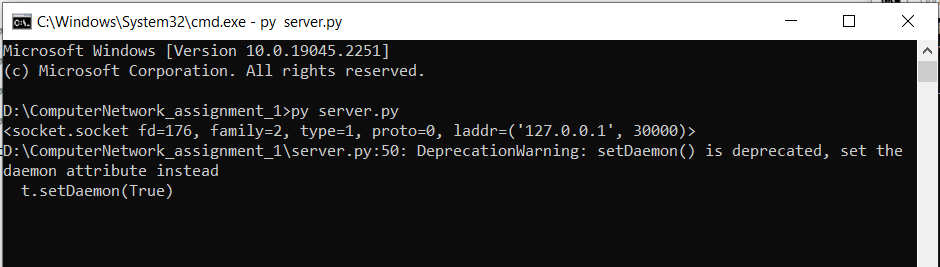

# P2P_Chat

A chat application for a simple P2P network.

- Programming language: Python 3.7.0

- Use only built-in libraries.

## Example

    serverport: 40000
    Your name: Hawk
    
    command list:
        register                          
        listpeer                            
        exit network                        
        request [peername]        
        chat message [peername] [message]   
        list connected peer                
        help                               
        disconnect [connected peer]                      
        exit                                
    
    >> register
    
    Register Successful.
    
    >> listpeer
    
    display all peers:
    peername: dawn---localhost:4000
    peername: hawk---localhost:40000
    
    >> chat request dawn
    
    chat accept: dawn --- localhost:4000
    
    >> chat message dawn Hello, dawn.
    
    >> disconnect dawn
    
    >> exit

Server:

Client_a:

Client_b:

